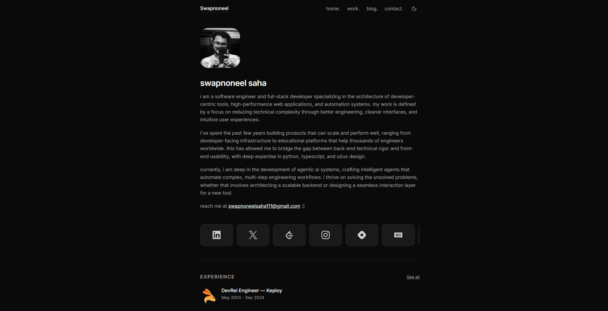

# Swapnoneel Saha — Personal Site

**Live Site:** [swapnoneel.site](https://www.swapnoneel.site)

[](https://nextjs.org/)
[](https://tailwindcss.com/)
[](https://ui.shadcn.com/)
[](https://www.typescriptlang.org/)

A premium, minimalist personal portfolio and blog built with the latest web technologies. Designed for high performance, accessibility, and architectural elegance.



---

## 🚀 Features

- **Infinite Project Carousel**: A seamless, auto-scrolling display for showcasing engineering projects and designs.
- **Achievements & Milestones**: A dedicated section for hackathon wins, open-source contributions, and technical highlights.
- **Markdown-Driven Content**: Fully dynamic blog, work experience, and project pages powered by local Markdown files.
- **Modern Tech Stack**: Leveraging Next.js 16 App Router, Tailwind CSS v4, and shadcn/ui for a state-of-the-art developer experience.
- **Interactive Integrations**:
  - **Cal.com**: Integrated booking system for scheduling calls.
  - **RSS Feed**: Automated RSS generation for blog updates.
  - **EmailJS**: Smooth contact form functionality.
  - **Responsive Layout**: Optimized for all devices with vibrant micro-animations.

---

## 🛠️ Tech Stack

| Layer               | Technology                               |
| ------------------- | ---------------------------------------- |
| **Framework**       | Next.js 16 (App Router)                  |
| **Styling**         | Tailwind CSS v4 + Motion                 |
| **Components**      | shadcn/ui                                |
| **Content**         | Markdown + gray-matter + next-mdx-remote |
| **Animations**      | CSS Transitions + Tailwind Animate       |
| **Package Manager** | pnpm                                     |

---

## 📂 Project Structure

```text
swapnoneel-site/
├── app/                # Next.js App Router (pages and layouts)
│   ├── blog/           # Blog listing and dynamic post pages
│   ├── work/           # Work experience and project details
│   └── globals.css     # Design system and Tailwind v4 config
├── components/         # Reusable UI components (Navbar, Carousel, etc.)
├── lib/                # Shared utilities and Markdown parsers
├── md/                 # ← All data resides here (blog, work, projects)
│   ├── blog/           # .md files for blog posts
│   ├── work/           # .md files for professional experience
│   └── projects/       # .md files for portfolio projects
├── public/             # Static assets (images, icons, etc.)
└── components.json     # shadcn/ui configuration
```

---

## ⚙️ Setup & Development

### Prerequisites

- [Node.js](https://nodejs.org/) v18+
- [pnpm](https://pnpm.io/) `npm install -g pnpm`

### Installation

1. **Clone the repository:**
   ```bash
   git clone https://github.com/Swpn0neel/swapnoneel-site.git
   cd swapnoneel-site
   ```
2. **Install dependencies:**
   ```bash
   pnpm install
   ```
3. **Run the development server:**
   ```bash
   pnpm dev
   ```
   Wait for the site to be available at `http://localhost:3000`.

---

## 📝 Configuration & Customization

### Content Management

- **Projects/Work/Blog**: Simply add or edit `.md` files in the respective `md/` subdirectories. The site automatically parses metadata (frontmatter) and renders content.
- **Site Configuration**: Core site details such as your bio, email, social links, Cal.com scheduling link, and Hashnode URL are managed centrally in `lib/config.ts`.

### Media

- **Profile Picture**: Replace `public/img/pfp.jpg` with your own photo. The UI supports an interactive flip-card effect using `pfp-hover.png`.

---

## 🚢 Deployment

The project is optimized for **Vercel**.

1. Push your changes to GitHub.
2. Connect your repository to Vercel.
3. The build settings are auto-detected. Deploy!

---

## 📜 License

Created by **Swapnoneel Saha**. Feel free to use this as inspiration for your own portfolio.
