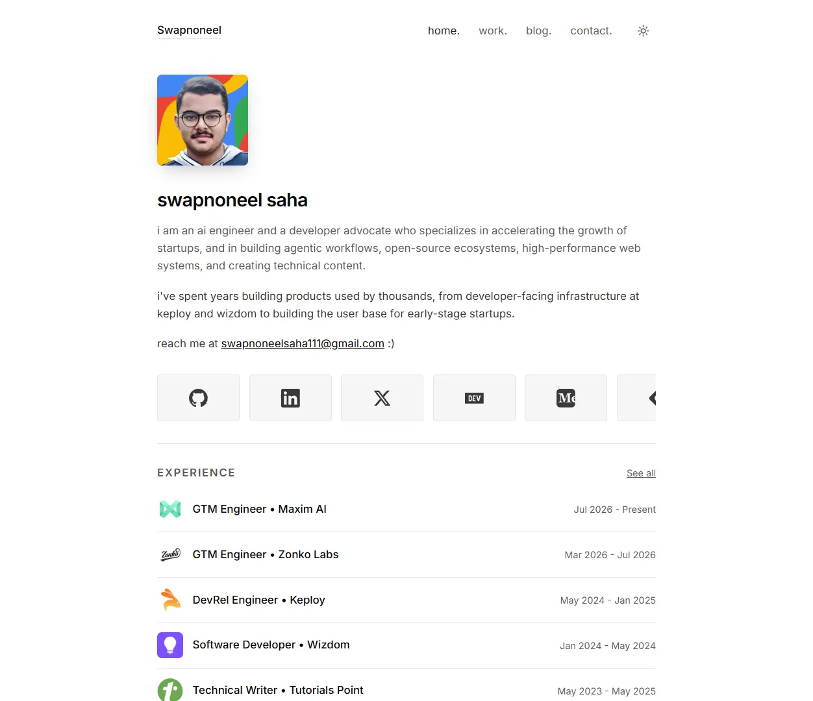

# Swapnoneel Saha - Personal Portfolio

An architecturally elegant, state-of-the-art developer portfolio and digital garden designed for extreme performance, accessibility, and modern aesthetics.

[](https://nextjs.org/) [](https://react.dev/) [](https://tailwindcss.com/) [](https://www.typescriptlang.org/) [](https://ui.shadcn.com/) [](https://vercel.com/)



[Explore Live Site](https://swapnoneel.hashnode.dev) | [Report Bug](https://github.com/Swpn0neel/swapnoneel-site/issues) | [Request Feature](https://github.com/Swpn0neel/swapnoneel-site/issues)

---

## Key Features & Engineering Highlights

This is not just another simple static portfolio. It is engineered from the ground up with automated content pipelines, custom build scripts, and modern web standards.

- **Next.js 16 & React 19 Engine**: Built entirely on the latest App Router architecture with Turbopack for ultra-fast compilation and optimal bundle delivery.
- **Modern UI & Micro-Animations**: Crafted using **Tailwind CSS v4** and **shadcn/ui**, featuring smooth transitions, dark and light theme morphing, and an interactive hover flip-card effect for user avatars.
- **Infinite Project & Work Carousel**: A seamless, fluid auto-scrolling showcase powered by Embla Carousel to present engineering achievements, hackathon victories, and open-source contributions.
- **Dynamic Markdown & MDX Content Pipeline**: Professional experience, technical blog posts, and projects are managed as local `.md` and MDX files, automatically parsed with `gray-matter` and `next-mdx-remote`.
- **AI & LLM Scraper Compatibility (`llms.txt`)**: Generates structured, token-optimized `/llms.txt` and full-text AI readability files (`llms-full.txt`) automatically during build time so autonomous agents and LLMs can seamlessly analyze the site content.
- **Automated Audio Blog Narrations**: Custom pre-commit and build scripts powered by `msedge-tts` automatically synthesize high-quality audio narrations for blog articles, allowing visitors to listen on the go.
- **Interactive Breakout Game Engine**: Includes a physics-balanced, built-in mini Easter egg Breakout game engineered directly into the TypeScript UI.
- **Seamless External Integrations**:
  - **Cal.com**: Embedded dual-theme call booking system for client consultations and coffee chats.
  - **EmailJS**: Zero-backend real-time contact form communication.
  - **RSS & Hashnode Sync**: Custom automated RSS generation and GraphQL integration.

---

## Blazing Fast & Lighthouse Optimized

Performance is treated as a first-class citizen. Every asset, script, and styling rule is strictly budgeted to deliver instant page loads, crystal-clear typography, and pristine Web Vitals.


### Performance Engineering Optimizations
- **Strict Asset Budgeting**: Favicon resources downscaled from massive 130KB images to hyper-optimized 96px WebP assets (~3KB), eliminating main-thread network congestion.
- **Automated Blur Placeholders**: Pre-build script (`generate-blur.mjs`) generates crisp base64 image placeholders via Sharp to guarantee zero Cumulative Layout Shift (CLS).
- **Dynamic Color Palettes**: Pre-computes harmonious background and UI theme accents (`generate-palette.mjs`) tailored directly to featured project visuals.
- **Sub-setted Typography**: Automatically optimizes font delivery (`generate-font-subset.mjs`) for lightning-fast First Contentful Paint (FCP).
- **Real-time Telemetry**: Integrated with Vercel Speed Insights and Analytics for continuous zero-overhead performance tracking.

---

## Technology Stack

| Architecture Layer      | Core Technologies |
| :---------------------- | :---------------- |
| **Framework & Engine**  | [Next.js 16](https://nextjs.org/) (App Router) + [React 19](https://react.dev/) |
| **Styling & Animation** | [Tailwind CSS v4](https://tailwindcss.com/) + Motion + CSS Transitions |
| **Component System**    | [shadcn/ui](https://ui.shadcn.com/) + Lucide Icons |
| **Content & Parser**    | Markdown + `gray-matter` + `next-mdx-remote` + Rehype Highlight |
| **Image & Build Tools** | [Sharp](https://sharp.pixelplumbing.com/) + Node.js Custom Pipeline Scripts |
| **Speech Synthesis**    | `msedge-tts` automated narration engine |
| **Code Quality**        | TypeScript 6, ESLint 9, Prettier with import and Tailwind class sorting |
| **Package Management**  | [pnpm](https://pnpm.io/) + Simple Git Hooks |

---

## Architecture & Directory Structure

```text
swapnoneel-site/
├── app/                  # Next.js 16 App Router (Layouts, routes, and API endpoints)
│   ├── blog/             # Dynamic blog listing and single-post reader view
│   ├── work/             # Work history and technical project deep-dives
│   ├── contact/          # Interactive contact forms and social gateways
│   └── globals.css       # Tailwind CSS v4 variables and custom utility layers
├── components/           # Reusable UI components (Navbar, Infinite Carousel, Cards, Game)
├── lib/                  # Site configs, Markdown parsers, TTS hooks, and Breakout engine
├── md/                   # Core data content store
│   ├── blog/             # Markdown articles and tech tutorials
│   ├── work/             # Professional career experiences
│   └── projects/         # Engineering milestones and hackathon wins
├── public/               # Static web assets
│   ├── img/              # Optimized headshots, avatars, and performance scores
│   └── narration/        # Auto-generated MP3 audio narrations for blog posts
├── scripts/              # Build utilities (blur generation, font subsetting, TTS, LLM txt)
└── components.json       # shadcn/ui configuration
```

---

## Getting Started

### Prerequisites
- [Node.js](https://nodejs.org/) (v18.0 or higher recommended)
- [pnpm](https://pnpm.io/) package manager (`npm install -g pnpm`)

### Local Development

1. **Clone the repository:**
   ```bash
   git clone https://github.com/Swpn0neel/swapnoneel-site.git
   cd swapnoneel-site
   ```

2. **Install dependencies:**
   ```bash
   pnpm install
   ```
   *(This automatically attaches simple-git-hooks for automated narration build hooks prior to commits).*

3. **Start the development server with Turbopack:**
   ```bash
   pnpm dev
   ```
   Open [http://localhost:3000](http://localhost:3000) to view the application in your browser. The dev server automatically executes pre-development checks including image blurring, palette map creation, and LLM text updates.

---

## Customization & Scripts

### Available NPM Scripts

| Command | Description |
| :--- | :--- |
| `pnpm dev` | Starts Next.js dev server with Turbopack and runs predev asset generation |
| `pnpm build` | Builds a production bundle with complete optimization pipeline |
| `pnpm start` | Launches the built production server |
| `pnpm format` | Formats all files with Prettier (auto-sorts Tailwind classes and imports) |
| `pnpm lint:fix` | Runs ESLint and automatically repairs linting warnings |

### Content & Configuration
- **Site Metadata**: Easily update name, bio, social links, Cal.com parameters, and email configuration directly in `lib/config.ts`.
- **Adding Content**: Simply drop a new `.md` file into `md/blog/`, `md/projects/`, or `md/work/`. Frontmatter metadata is automatically extracted and styled.

---

## Deployment

This application is architecturally tailored for deployment on **Vercel** with zero configuration required:

1. Push your latest code to your GitHub repository.
2. Import the project into your Vercel Dashboard.
3. Vercel automatically detects Next.js, installs `pnpm` dependencies, and executes the automated build scripts (`prebuild`).
4. Hit **Deploy** and watch your high-performance portfolio go live instantly!

---

Built with perfection. Feel free to reference this architecture for your own developer site!
