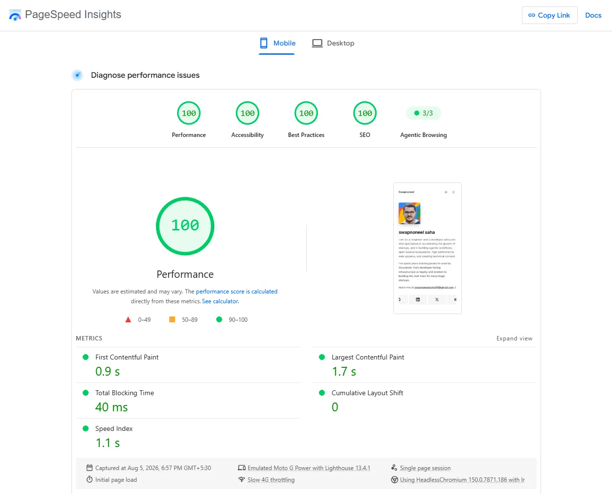

# Swapnoneel Saha - Personal Portfolio

An architecturally elegant, state-of-the-art developer portfolio and digital garden designed for extreme performance, accessibility, and modern aesthetics.

[](https://astro.build/) [](https://tailwindcss.com/) [](https://www.typescriptlang.org/) [](https://vercel.com/)


[Explore Live Site](https://swapnoneel.hashnode.dev) | [Report Bug](https://github.com/Swpn0neel/swapnoneel-site/issues) | [Request Feature](https://github.com/Swpn0neel/swapnoneel-site/issues)

---

## Key Features & Engineering Highlights

This is not just another simple static portfolio. It is engineered from the ground up with automated content pipelines, custom build scripts, and modern web standards.

- **Astro 7, static output**: every route is prerendered to HTML. The build emits no serverless functions at all, so there is no cold start and no on-demand work on any request.
- **Modern UI & Micro-Animations**: **Tailwind CSS v4** with hand-written CSS transitions — a steerable View Transition theme wipe you can reverse mid-flight, and an interactive flip-card avatar.
- **Infinite Project & Work Carousel**: A seamless, fluid auto-scrolling showcase powered by Embla Carousel to present engineering achievements, hackathon victories, and open-source contributions.
- **Typed Markdown content pipeline**: blog posts, work history and projects are local `.md` files loaded through Astro content collections, validated by Zod schemas, and transformed by purpose-built rehype plugins.
- **AI & LLM Scraper Compatibility (`llms.txt`)**: Generates structured, token-optimized `/llms.txt` and full-text AI readability files (`llms-full.txt`) automatically during build time so autonomous agents and LLMs can seamlessly analyze the site content.
- **Automated Audio Blog Narrations**: Custom pre-commit and build scripts powered by `msedge-tts` automatically synthesize high-quality audio narrations for blog articles, allowing visitors to listen on the go.
- **Interactive Breakout Game Engine**: Includes a physics-balanced, built-in mini Easter egg Breakout game engineered directly into the TypeScript UI.
- **Seamless External Integrations**:
  - **Cal.com**: Embedded dual-theme call booking system for client consultations and coffee chats.
  - **EmailJS**: Zero-backend real-time contact form communication.
  - **RSS & Hashnode Sync**: Custom automated RSS generation and GraphQL integration.

---

## Blazing Fast & Lighthouse Optimized

Performance is treated as a first-class citizen. Every asset, script, and styling rule is strictly budgeted to deliver instant page loads, crystal-clear typography, and pristine Web Vitals.



### Performance Engineering Optimizations

- **Zero framework JavaScript on most routes**: every interactive element — theme toggle, mobile nav, carousels, project overlay, the 404 game — is hand-written vanilla TypeScript loaded per page. The home page ships ~10 KB of JS; `/work/others` ships under 6 KB.
- **Build-time images**: `astro:assets` encodes every image from its original at `effort: 6`, sized to the four widths the layout actually uses. Nothing is transcoded on demand, so there is no cold-cache first visitor.
- **Build-time syntax highlighting**: `rehype-highlight` tags tokens at build and five CSS custom properties colour them, all chosen to clear 4.5:1 on the code background in both themes. No highlighter ships to the browser.
- **Dynamic colour palettes**: `generate-palette.mjs` pre-computes each project cover's dominant hues so its card can paint a brand-matched gradient behind the screenshot.
- **Font delivered by `astro:fonts`**: one hashed, immutably-cached variable face with a metric-matched fallback and `font-display: optional`, so the layout is decided once and never shifts.
- **Real-time telemetry**: Vercel Speed Insights and Analytics, injected as edge-served scripts with no package in the bundle.

---

## Technology Stack

| Architecture Layer      | Core Technologies                                                                                |
| :---------------------- | :----------------------------------------------------------------------------------------------- |
| **Framework & Engine**  | [Astro 7](https://astro.build/) — static output, zero client framework by default                |
| **Styling & Animation** | [Tailwind CSS v4](https://tailwindcss.com/) (Vite plugin) + CSS transitions and View Transitions |
| **Interactivity**       | Hand-written vanilla TypeScript islands; one React island (the blog narrator)                    |
| **Content & Parser**    | Markdown via Astro content collections + Zod schemas + custom rehype plugins                     |
| **Images & Fonts**      | `astro:assets` (Sharp) and `astro:fonts`                                                         |
| **Open Graph**          | `satori` + `@resvg/resvg-js`, rendered to static PNGs at build                                   |
| **Speech Synthesis**    | `msedge-tts` automated narration engine                                                          |
| **Code Quality**        | TypeScript, ESLint 9 (`eslint-plugin-astro`), Prettier with import and Tailwind class sorting    |
| **Package Management**  | [pnpm](https://pnpm.io/) + Simple Git Hooks                                                      |

---

## Architecture & Directory Structure

```text
swapnoneel-site/
├── src/
│   ├── pages/            # File-based routes (home, blog, work, contact, resume, 404)
│   │   ├── og/           # Open Graph cards, rendered to static PNGs at build
│   │   ├── feed.xml.ts   # RSS
│   │   └── sitemap.xml.ts
│   ├── content/          # Markdown content store, typed by src/content.config.ts
│   │   ├── blog/         # Articles, filed by year (the year is not part of the URL)
│   │   ├── work/         # Professional career experiences
│   │   └── projects/     # Engineering milestones and hackathon wins
│   ├── components/       # .astro components — no client JS unless they ask for it
│   ├── islands/          # The one React component left (blog narrator)
│   ├── scripts/          # Vanilla TS behaviour, imported by component <script> tags
│   ├── plugins/          # rehype transforms: code blocks, blog images, external links
│   ├── layouts/          # Base document shell
│   ├── assets/           # Images and fonts processed by the build
│   └── styles/           # Tailwind v4 variables and custom layers
├── lib/                  # Framework-free helpers: config, i18n, Breakout engine
├── public/               # Served verbatim: favicon, llms.txt, narration manifests
├── scripts/              # Build utilities (palette, narration, llms.txt, heading guard)
└── astro.config.mjs
```

---

## Getting Started

### Prerequisites

- [Node.js](https://nodejs.org/) 20 LTS or newer (Astro 7 requirement)
- [pnpm](https://pnpm.io/) package manager (`npm install -g pnpm`)

### Local Development

1. **Clone the repository:**

   ```bash
   git clone https://github.com/Swpn0neel/swapnoneel-site.git
   cd swapnoneel-site
   ```

2. **Install dependencies:**

   ```bash
   pnpm install
   ```

   _(This automatically attaches simple-git-hooks for automated narration build hooks prior to commits)._

3. **Start the development server:**
   ```bash
   pnpm dev
   ```
   Open [http://localhost:4321](http://localhost:4321). The dev server first runs the content generators — blog dates, palette map, `llms.txt`, and narration sync.

---

## Customization & Scripts

### Available NPM Scripts

| Command         | Description                                                               |
| :-------------- | :------------------------------------------------------------------------ |
| `pnpm dev`      | Runs the content generators, then starts the Astro dev server             |
| `pnpm build`    | Builds the static site, then verifies every heading anchor still resolves |
| `pnpm preview`  | Serves the built output locally                                           |
| `pnpm check`    | `astro check` — types and template diagnostics                            |
| `pnpm format`   | Formats all files with Prettier (auto-sorts Tailwind classes and imports) |
| `pnpm lint:fix` | Runs ESLint and automatically repairs linting warnings                    |

### Content & Configuration

- **Site Metadata**: Easily update name, bio, social links, Cal.com parameters, and email configuration directly in `lib/config.ts`.
- **Adding Content**: Drop a new `.md` file into `src/content/blog/<year>/`, `src/content/projects/`, or `src/content/work/`. Frontmatter is validated against the Zod schema in `src/content.config.ts`, so a typo in a field name fails the build instead of rendering blank.
- **Post images**: put them in `src/assets/blog-img/<year>/<slug>/` and reference them with a relative path — the build resizes, re-encodes and hashes them. Pasting a syndicated draft with remote image URLs? Run `node scripts/mirror-blog-images.mjs` to pull them local and rewrite the links.
- **Heading anchors**: `scripts/heading-ids.fixture.json` records every `#anchor` the live site publishes, and `pnpm build` fails if one disappears.

---

## Deployment

This application is architecturally tailored for deployment on **Vercel** with zero configuration required:

1. Push your latest code to your GitHub repository.
2. Import the project into your Vercel Dashboard.
3. Vercel detects Astro (pinned in `vercel.json`), installs `pnpm` dependencies, and runs the build. The output is fully static — no serverless functions.
4. Hit **Deploy** and watch your high-performance portfolio go live instantly!

---

Built with perfection. Feel free to reference this architecture for your own developer site!
