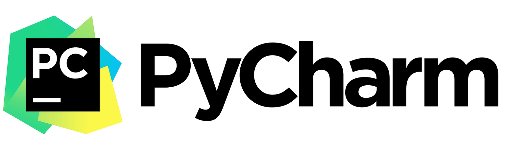
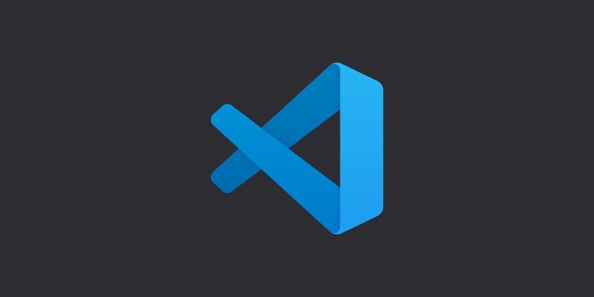
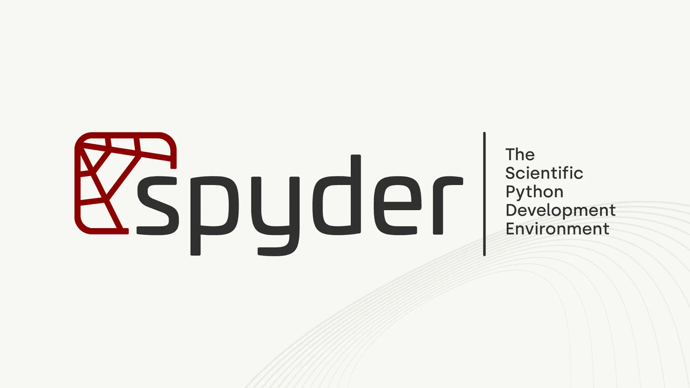
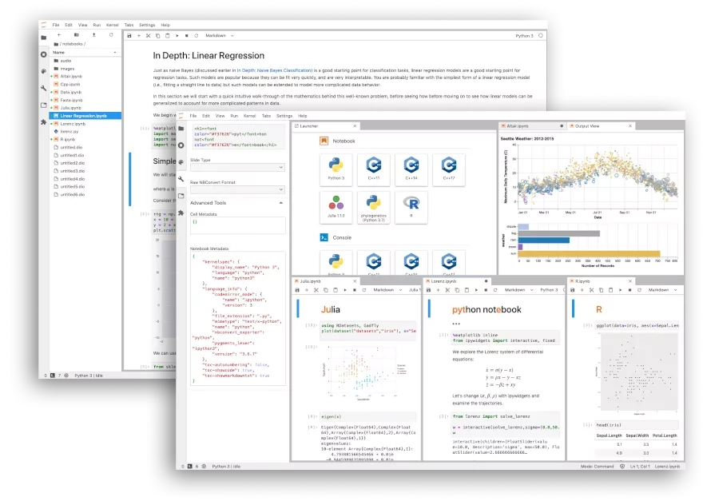
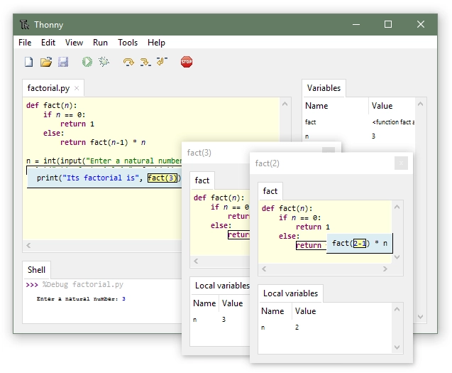

The best Python editor is the one that makes your next task easier. That may be a full IDE with refactoring and debugging, or it may be a small editor with a terminal beside it.

So, which one should you install? It depends on what you are doing with Python. A data scientist opening a notebook has a different problem from a beginner tracing their first loop, and both have a different problem from someone maintaining a large web application.

These five options fit those kinds of work in different ways, so pretending one tool wins every category would be misleading. My pick is at the end, but keep your machine, project size, and patience for configuration in the decision.

## PyCharm

PyCharm is the easiest recommendation for a large Python project. It understands a project as more than a folder of files, so navigation, refactoring, debugging, virtual environments, and Git all live in one place.

The editor can complete code, flag errors while you type, and rename symbols across a project. Its debugger is comfortable once you learn the controls, and the Professional edition adds support for web frameworks such as Django and Flask.

The tradeoff is weight. PyCharm can use a lot of memory, especially on an older machine, and the Professional edition is paid. The free Community edition is enough for many Python projects, but check which features you need before building your workflow around one edition.

Choose PyCharm when you want Python-specific tools ready when you open the project. I would not choose it for a quick one-file script unless I already had it open.

## VS Code

VS Code is the most flexible option in this list. It is a general editor rather than a Python IDE out of the box, but the Python extension adds code completion, debugging, environment selection, and test support.

The built-in terminal and Git view make it easy to move between editing, running a command, and checking a change. You can also add support for Docker, notebooks, JavaScript, and many other tools without leaving the editor.

That flexibility has a price. New users can spend more time choosing extensions and settings than writing Python. When the wrong extension takes over formatting or the interpreter points at the wrong environment, the editor does not always make the cause obvious.

Choose VS Code if you work across several languages or want one editor that can grow with your projects. It is my general recommendation, even though it takes more setup than PyCharm.

## Spyder

Spyder is built around data exploration. Its layout gives you an editor, an interactive console, plots, and a variable explorer in the same workspace. You can run a few lines, inspect the resulting DataFrame, and keep going without adding print statements everywhere.

That variable explorer is the reason to try Spyder. Seeing arrays and tables directly is useful when you are learning how a calculation changes the data. Spyder is free and open source, and it is often installed alongside Anaconda.

It is less comfortable for web applications or a general software project with many packages and services. The project tools are not as broad as those in PyCharm or VS Code, so the editor can feel like the wrong shape once your work stops being notebook-like.

Choose Spyder when your day is mostly NumPy, Pandas, plots, and experiments.

## Jupyter Notebook

Jupyter Notebook is an interactive environment rather than a traditional IDE. You write code in cells, run one cell at a time, and place Markdown explanations beside the output.

That workflow is excellent for exploratory data analysis, machine learning experiments, and teaching. You can show the code that produced a chart directly next to the chart, which makes a notebook easy to share as a record of an investigation.

The same flexibility can make a notebook messy. Cells can run out of order, hidden state can survive longer than you expect, and a project spread across several notebooks is harder to maintain than a normal Python package. A notebook is a poor place to hide application logic that needs regular tests.

Choose Jupyter when you want to ask questions of data and see the answer immediately. Move reusable code into `.py` files once the experiment starts becoming a product.

## Thonny

Thonny is aimed at people who are learning Python. The interface removes many distractions, and its debugger lets you step through a program while watching values change.

That visual step-through is useful because beginners often know what a line says but not when it runs or what value it leaves behind. Thonny makes those changes visible without asking you to configure a large toolchain first.

It is free and friendly, but it is not designed for a large application. The extension and customization choices are limited, and you will probably outgrow it once you need a more complex project layout or a broad set of integrations.

Choose Thonny if you are learning the language and want the editor to stay out of your way.

## How to choose without overthinking it

Start with the work you will do most often. If you need a debugger and project-wide refactoring, try PyCharm or VS Code. If you inspect tables and plots, try Spyder or Jupyter. If you are learning your first loops and functions, Thonny is enough.

Also consider the cost of a tool you will not use. A large IDE cannot fix unclear requirements, and a notebook cannot give a production service a test suite. Your editor should support the next problem you expect to solve, not the most impressive screenshot.

## My pick

For a general Python workflow, I would pick VS Code because it handles Python well and leaves room for other languages and tools. PyCharm is the better choice when Python is the whole project and you want its deeper project support without assembling extensions.

That is my winner for this list, but that's just me, and your workflow might be different.

There are plenty of other editors worth trying. Give each option one real task instead of judging it from a feature page. The small annoyances show up when you create an environment, run a test, jump to a definition, and debug a failing line.

For more posts, you can follow me on [Twitter (swapnoneel123)](http://twitter.com/swapnoneel123). My [GitHub (Swpn0neel)](https://github.com/Swpn0neel) has some of my projects too.
