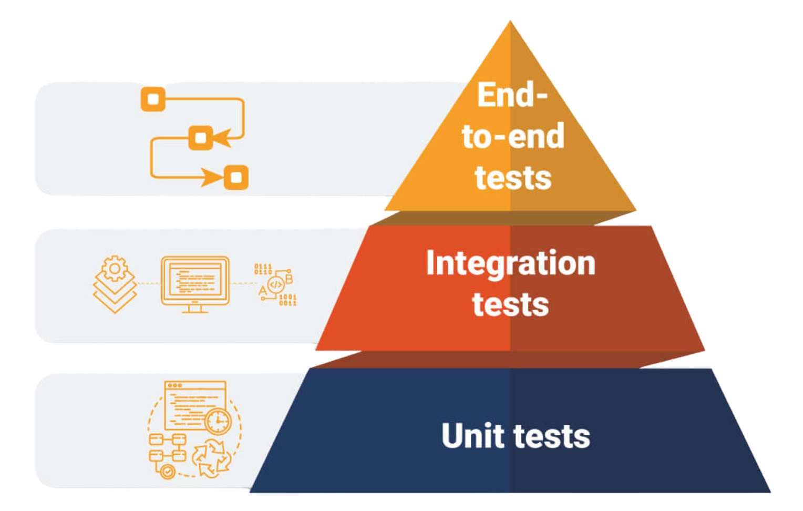

Software testing asks a plain question: does the program behave the way you expect when someone uses it? A useful test gives you evidence before a change reaches a user, and a failing test gives you a smaller place to start looking.

The testing pyramid is a way to divide that evidence. You put many fast tests at the bottom, fewer tests that check real connections in the middle, and a small number of full user journeys at the top. The shape is a reminder about feedback speed and maintenance cost, not a law that every project must follow exactly.

## The three layers

Read the pyramid from the bottom upward. Each layer answers a different question, and each one catches failures that the others can miss.

### Unit tests check one piece of logic

A unit test exercises a small part of your code, usually a function, method, or class, without starting a database or calling a remote service. You give the unit an input, make a prediction, and check the result.

These tests are usually quick to run, which makes them useful while you are editing code and in continuous integration. They also make failures easier to inspect because fewer moving parts are involved.

The tradeoff is isolation. A unit test can prove that a function handles a discount correctly, but it cannot prove that your checkout service sends the right value to the payment provider.

### Integration tests check connections

Integration tests exercise the boundary between pieces of a system. That might be an HTTP handler talking to a service, a repository talking to a database, or two modules passing data between each other.

The test setup is heavier because you need more than the function under test. You might start a test database, provide a configured client, or run a local service. That extra work makes these tests slower, but it also lets them catch mismatched fields, bad serialization, missing configuration, and other connection problems.

You do not need to avoid every fake dependency here. The useful question is which boundary you want to check. If the database is the subject, use a real isolated database. If an external billing service is unavailable in tests, a controlled substitute may be the safer choice.

### End-to-end tests check a user journey

End-to-end tests drive the application as a user would. A test might open the login page, submit credentials, and check that the account page appears. It crosses the browser, application server, data store, and other configured pieces.

That realism comes with a price. These tests take longer, need more setup, and can fail because of a browser timing issue or an environment problem. Keep them for flows where a failure would matter to a user, then use the lower layers for the many smaller cases underneath.

## Why the shape matters

Suppose a tax calculation is wrong. A unit test can point to the calculation within seconds. If the only test is an end-to-end checkout test, you first wait for the whole flow, then inspect several services before finding the same mistake.

The pyramid pushes most feedback toward the cheaper layers. It also limits the amount of setup you have to maintain. A project with only end-to-end tests can work, but each small code change may require a long, fragile journey before you know whether the basic logic still works.

My caveat is that the picture can make teams chase a ratio instead of useful coverage. A small service with a few carefully chosen integration tests may not look like a perfect pyramid, and that is fine if those tests protect the real risks.

## How to build the layers

Start with the behavior that would hurt if it broke. Write unit tests for pure calculations and branching logic. Add integration tests around the boundaries where data changes shape or leaves your process. Add end-to-end coverage for the shortest set of journeys that represent the product's most important actions.

Run the fast tests on every change. Run integration tests in an isolated environment often enough to catch broken connections before release. Run end-to-end tests as part of the delivery checks, but do not make every small assertion depend on a full browser session.

When a test fails, fix the test or the product code rather than making the assertion weaker just to get a green build. Also, delete tests that duplicate a lower layer without checking anything new. Test code is still code, and stale test code can waste your time.

## Where teams get stuck

The first obstacle is usually setup. A new test suite needs a runner, fixtures, test data, and a place to run safely. Start with one narrow path and make it repeatable before adding more cases.

Maintenance is the next cost. Tests that know too much about implementation details break during harmless refactors. Assert the behavior a user or calling function depends on, not every internal step used to produce it.

The final trap is treating speed as the only measure. Fast tests that never exercise a real boundary will not find a broken database query. Slow tests that cover every tiny branch will make feedback painful. The layers work when each one has a job.

## The practical takeaway

Use the pyramid as a conversation about risk. Unit tests give you quick answers about local logic, integration tests check that neighboring parts speak the same language, and end-to-end tests confirm that important journeys work from the outside.

There is no prize for drawing the most symmetrical pyramid. Put the tests where they can tell you something useful, keep the expensive journeys focused, and make the fast checks easy to run before you forget why the change was made.

