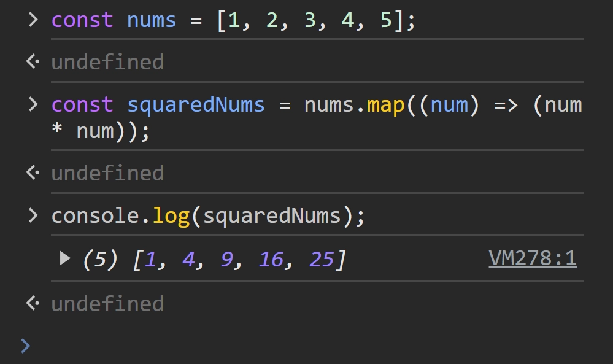
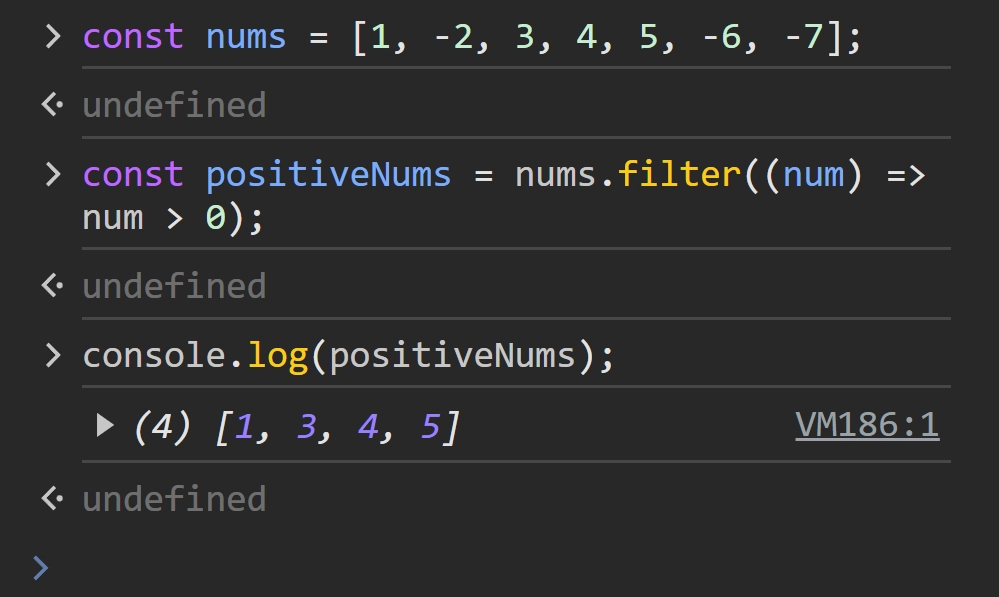
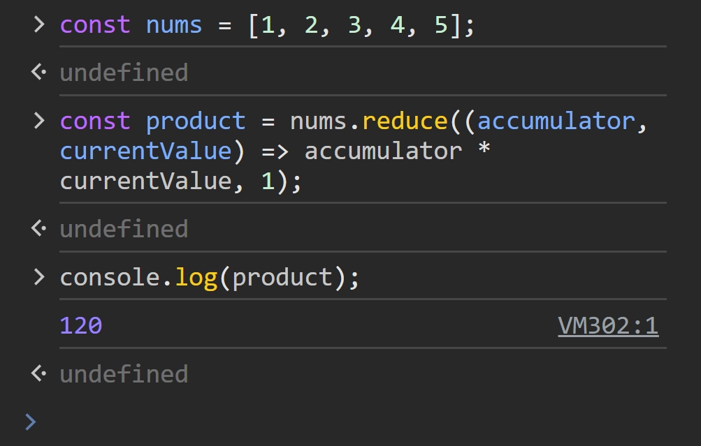

An array is useful because it keeps related values together. The awkward part begins when you need to change every value, keep only some values, or combine all of them into one result.

That is where `map()`, `filter()`, and `reduce()` fit. They are higher-order functions because they receive another function as an argument. You describe the operation once, and JavaScript calls it for the array values.

You will see these methods in browser code, server code, and UI libraries such as React. The syntax is compact, but the idea underneath is simple: transform, select, or combine.

## The map() function

Use `map()` when every item should produce a corresponding item in a new array. The original array stays unchanged, and the new array has the same number of positions unless your callback changes the value to something else.

### Syntax

```javascript
array.map((element, index, array) => {
  // return the new value for this element
});
```

The callback receives the current `element`, its `index`, and the full `array`. Most of the time, the element is enough.

### Example

Here, each number is multiplied by itself. The input remains `[1, 2, 3, 4, 5]`, while `squaredNums` receives the new values.

```javascript
const nums = [1, 2, 3, 4, 5];

const squaredNums = nums.map((num) => num * num);

console.log(squaredNums); // [1, 4, 9, 16, 25]
```

The browser console shows the transformed array:



If your callback does not return a value, the new array contains `undefined` for those positions. That small mistake is common when a block-bodied arrow function uses braces but forgets `return`.

## The filter() function

Use `filter()` when you want a smaller array containing only the items that pass a test. The callback should return a truthy or falsy value. JavaScript keeps the item when the result is truthy and skips it when the result is falsy.

### Syntax

```javascript
array.filter((element, index, array) => {
  // return true to keep the element
});
```

The callback receives the same three arguments as `map()`, but its job is different. You are answering "keep this item?" rather than creating a replacement value.

### Example

This callback keeps positive numbers and removes the negative ones:

```javascript
const nums = [1, -2, 3, 4, 5, -6, -7];

const positiveNums = nums.filter((num) => num > 0);

console.log(positiveNums); // [1, 3, 4, 5]
```

Here is the corresponding browser output:



An empty result is not an error. It simply means that no item passed the test. That makes `filter()` useful for searches, permission checks, and lists where the visible items depend on a condition.

## The reduce() function

Use `reduce()` when an array should become one final value. That value can be a number, string, object, or even another array. Because `reduce()` can do many jobs, it is also the method most likely to become hard to read.

### Syntax

```javascript
array.reduce((accumulator, currentValue, index, array) => {
  // return the accumulator for the next iteration
}, initialValue);
```

The `accumulator` carries the result forward. `currentValue` is the item being processed now. The `initialValue` gives the accumulator a known starting point, which also keeps the behavior clear when the input array is empty.

### Example

To multiply all the numbers, start the accumulator at `1`. The first pass multiplies `1` by `1`, the next pass multiplies that result by `2`, and so on until the final product is returned.

```javascript
const nums = [1, 2, 3, 4, 5];

const product = nums.reduce(
  (accumulator, currentValue) => accumulator * currentValue,
  1
);

console.log(product); // 120
```

The browser console shows the final value:



When the accumulator is an object or an array, return that same accumulator after updating it. Also, do not use `reduce()` just because you can. A short `map()` or `filter()` chain often tells the reader more about your intent.

## Choosing the right method

Ask what should happen to the array. If each input needs a corresponding output, use `map()`. If some inputs should disappear, use `filter()`. If everything must become one value, use `reduce()`.

You can combine them when the steps are genuinely separate. For example, `orders.filter(...).map(...)` first removes orders you do not want and then formats the remaining ones. Give each callback a useful name if the expression stops being easy to read.

My caveat is that `reduce()` is not automatically the most advanced choice. I would rather read two obvious passes than decode one clever accumulator, especially when another person has to debug it later.


